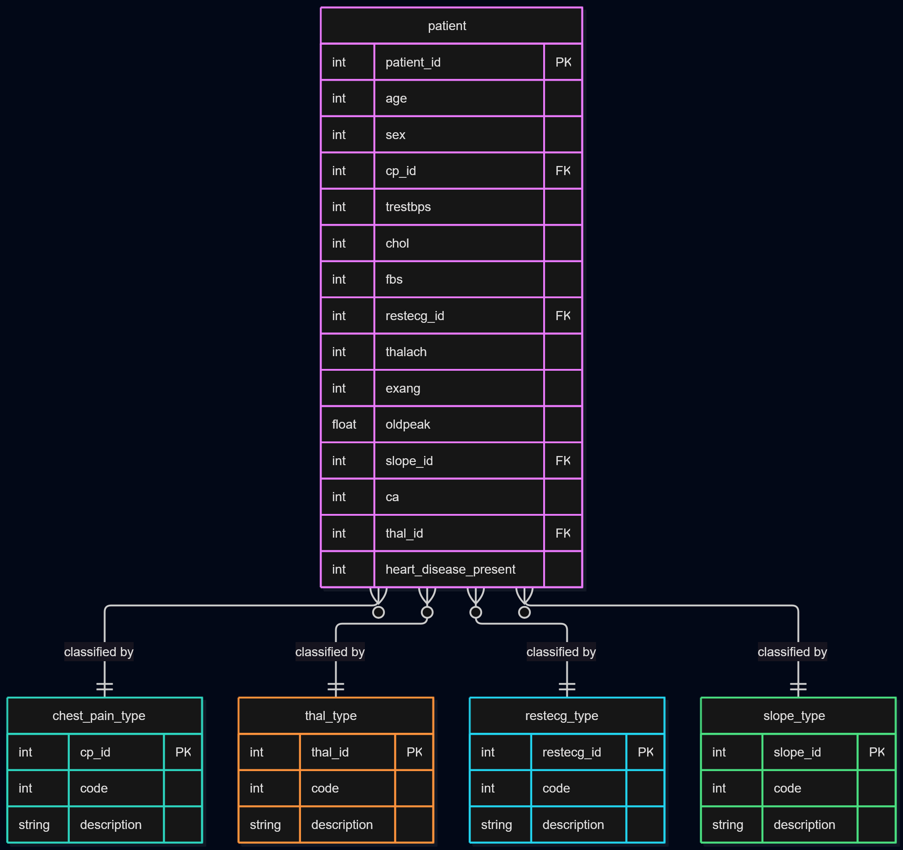

# Heart Disease Risk Analysis Platform

A full-stack clinical data platform for analyzing and predicting heart disease risk using the UCI Cleveland Heart Disease dataset. Features a normalized PostgreSQL database, a Flask REST API, a React/TypeScript frontend, and a logistic regression model for real-time risk prediction. The entire application is containerized with Docker Compose.


## Setup and Running

### Prerequisites
- Docker Desktop
- Git

### Quick Start
Clone the repository and create a `.env` file in the root directory using `.env.example` as a template:

```bash
cp .env.example .env
```

Fill in your values, then start the application:

```bash
docker compose up --build
```

The frontend will be available at `http://localhost:5173` and the API at `http://localhost:5000`.

### Loading the Data
With the containers running, load the database:

```bash
docker compose exec backend python3 load_data.py
```

### Local Development (without Docker)
Install Python dependencies:

```bash
pip install -r requirements.txt
```

Install frontend dependencies:

```bash
cd frontend && npm install
```

Start the backend:

```bash
python3 backend/server.py
```

Start the frontend:

```bash
cd frontend && npm run dev
```


## Tech Stack

**Backend**
- Python, Flask, SQLAlchemy
- PostgreSQL
- scikit-learn (logistic regression)

**Frontend**
- React, TypeScript, Vite
- Tailwind CSS, Axios

**Infrastructure**
- Docker, Docker Compose


## API Endpoints

### Health
| Method | Endpoint | Description |
|--------|----------|-------------|
| GET | `/api/health` | Health check |

### Patients
| Method | Endpoint | Description |
|--------|----------|-------------|
| GET | `/api/patients/` | Return all patients, supports `?sex=` and `?heart_disease_present=` filters |
| GET | `/api/patients/<id>` | Return a single patient by ID |

### Statistics
| Method | Endpoint | Description |
|--------|----------|-------------|
| GET | `/api/stats/summary` | Overall dataset statistics |
| GET | `/api/stats/by-age` | Heart disease presence grouped by age range |
| GET | `/api/stats/by-chest-pain` | Heart disease presence grouped by chest pain type |
| GET | `/api/stats/by-sex` | Heart disease presence grouped by sex |
| GET | `/api/stats/by-thal` | Heart disease presence grouped by thalassemia type |
| GET | `/api/stats/risk-factors` | Average clinical measurements by heart disease presence |

### Lookups
| Method | Endpoint | Description |
|--------|----------|-------------|
| GET | `/api/lookups/chest-pain-types` | All chest pain type classifications |
| GET | `/api/lookups/thal-types` | All thalassemia type classifications |
| GET | `/api/lookups/restecg-types` | All resting ECG classifications |
| GET | `/api/lookups/slope-types` | All slope type classifications |

### Prediction
| Method | Endpoint | Description |
|--------|----------|-------------|
| POST | `/api/predict` | Accept patient clinical values and return heart disease risk score |


## Database Schema



The schema is organized into five tables: `patient`, `chest_pain_type`, `thal_type`, `restecg_type`, and `slope_type`. The database is designed to be in Third Normal Form (3NF).

### Design rationale

The `patient` table stores core clinical measurements and references four lookup tables for categorical values: chest pain type, thalassemia type, resting ECG results, and slope type. Storing these as normalized lookup tables rather than raw integers makes the data self-documenting and allows new classifications to be added without schema changes.

A `patient_flat` view joins all tables back into a flat structure for simplified querying across the API.

### Scalability

At scale, this schema holds up well:

- **Query performance**: indexes on foreign key columns (`cp_id`, `restecg_id`, `slope_id`, `thal_id`) keep joins fast as row counts grow
- **New classifications**: lookup tables accommodate new values without `ALTER TABLE`
- **New measurements**: additional clinical attributes can be added as columns to `patient` without restructuring the core schema

The schema would migrate to a larger PostgreSQL deployment with minimal changes, and the same structure supports partitioning by patient cohort or dataset origin for parallel query execution.


## Code Structure
```
heart-disease-risk-analysis-platform/
├── backend/
│ ├── app.py # Flask application factory
│ ├── config.py # Database and app configuration
│ ├── server.py # Application entry point
│ ├── models/
│ │ ├── base.py # SQLAlchemy instance
│ │ ├── patient.py # Patient model
│ │ └── lookups.py # Lookup table models
│ ├── routes/
│ │ ├── patients.py # Patient endpoints
│ │ ├── stats.py # Statistics endpoints
│ │ ├── lookups.py # Lookup endpoints
│ │ └── predict.py # Prediction endpoint
│ └── ml/
│ ├── train.py # Model training script
│ ├── model.joblib # Trained logistic regression model
│ └── scaler.joblib # Fitted standard scaler
├── frontend/
│ └── src/
│ ├── api/
│ │ └── client.ts # Axios API client
│ ├── components/
│ │ ├── Navbar.tsx # Navigation bar
│ │ └── Layout.tsx # Page layout wrapper
│ └── pages/
│ ├── Dashboard.tsx # Summary statistics
│ ├── Patients.tsx # Patient table with filtering
│ ├── Stats.tsx # Statistical breakdowns
│ └── Predict.tsx # Risk prediction form
├── data/
│ ├── heart_disease_uci.csv # UCI Cleveland Heart Disease dataset
│ └── seed.sql # Lookup table seed data
├── design_docs/
│ └── er-diagram.svg # Entity relationship diagram
├── load_data.py # Database initialization and data loading
├── docker-compose.yml # Docker service orchestration
└── .env.example # Environment variable template
```


### Design decisions

The backend is split into `load_data.py` for database initialization and the Flask app for serving the API. This keeps data ingestion and application logic independent.

Routes are organized into blueprints by domain (`patients`, `stats`, `lookups`, `predict`), making each area independently readable and extensible. The ML model is loaded once at app startup via the Flask application context rather than on each request.

The frontend follows a pages and components pattern with a centralized API client, keeping data fetching logic consistent across all pages.